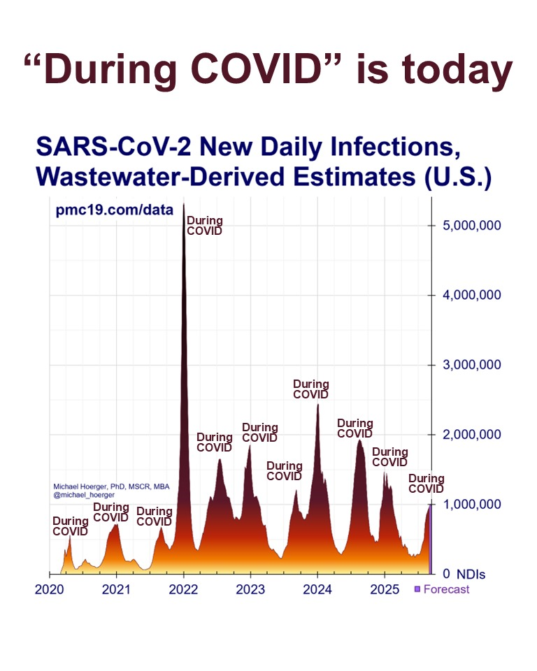

Hey there stranger! If you're casually using the expression "during covid" then you are propagating a harmful assumption that "covid is over".

## What to say instead

When someone says "during covid" they usually mean "during covid restrictions" or "during covid lockdowns". So try to say just that, or maybe "during early stage pandemic". 

## The data

*Data visualization showing continuous waves of COVID-19 infections from 2020 through 2025, demonstrating that "During COVID" is indeed today. Click the image to view the source on Instagram.*

## Resources

Want to learn more? 

- [Latest infection estimates based on wastewater (JP Weiland)](https://bsky.app/profile/jpweiland.bsky.social)
- [Pandemic Mitigation Collaborative - Wastewater Data](https://www.pmc19.com/data/index.php)
- [What COVID does to the body](https://www.panaccindex.info/p/what-covid-19-does-to-the-body-eighth)
- [Yes, we continue wearing masks](https://whn.global/yes-we-continue-wearing-masks/)
- [What's up with covid and how to protect yourself](https://newlevant.com/covidzine)
- [Find your nearest maskbloc](https://maskbloc.org/)
- [What is a maskbloc?](https://thesicktimes.org/2024/09/10/a-brief-oral-history-of-mask-blocs-part-1)
